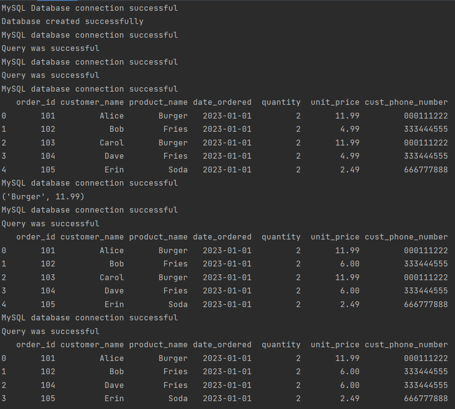

# py-sql-example

A python script for CRUD operations on an example SQL database.



## How to use

1. Clone the repository.
2. Install dependencies
   `pip install mysql-connector-python`
   `pip install pandas`
3. At the root of your project, create a "env.py" file with your username and password for the localhost SQL connection.

```
username=your_username
password=your_password
```

4. Execute the command `py main.py` in the PyCharm terminal.
